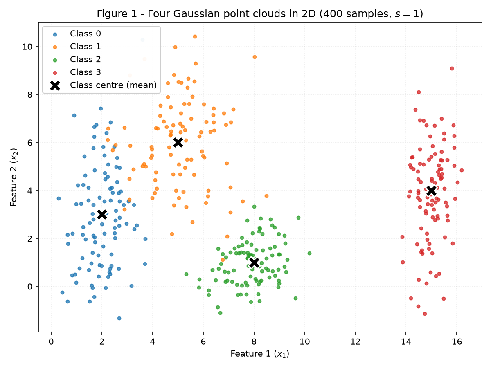
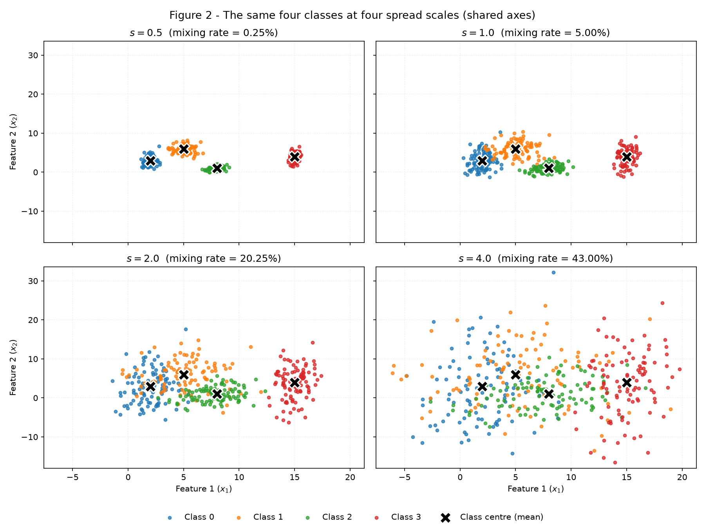
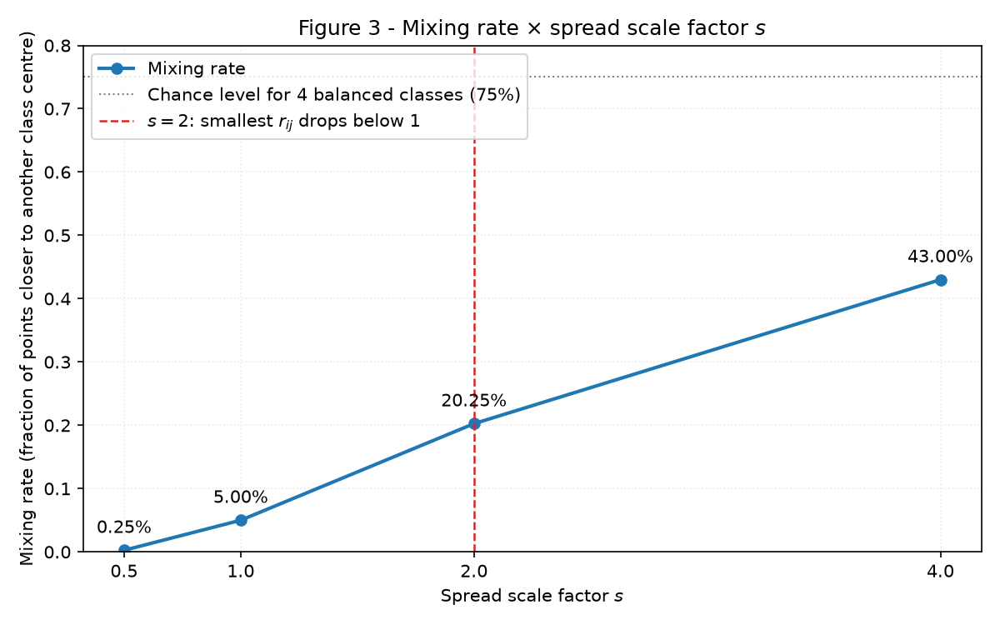
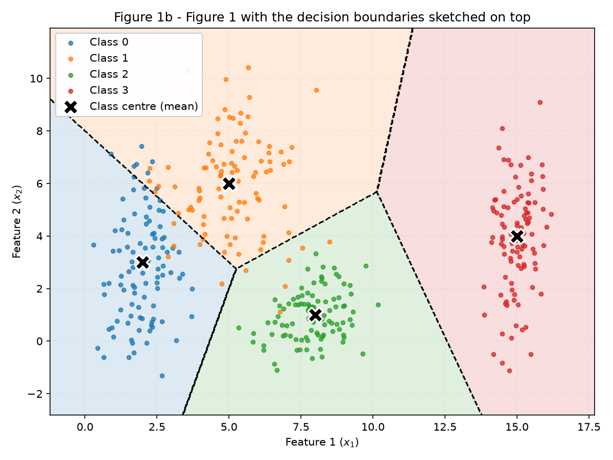
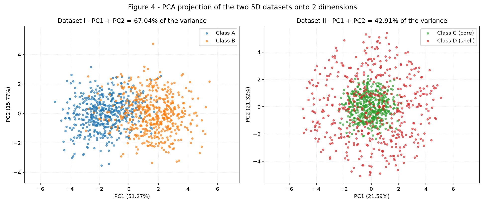
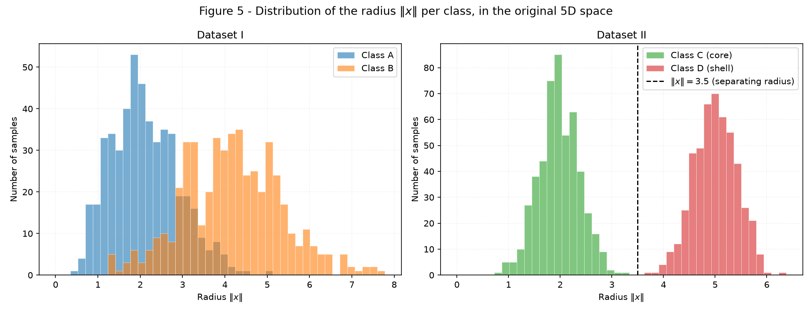
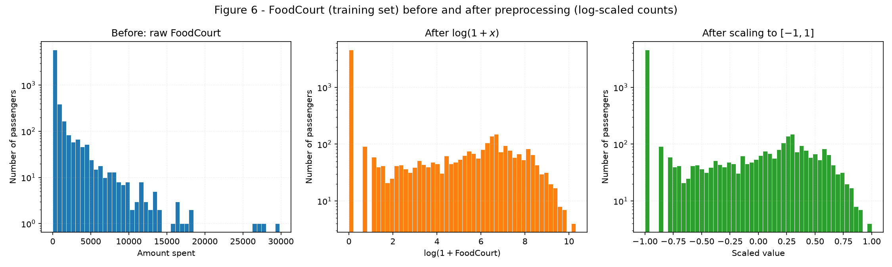

# Data — Data Preparation and Analysis for Neural Networks

**Luca Santana Feltrin** — Insper, ANN & Deep Learning 2026.2

The thread running through this activity is the **spread** of the data: how much a point cloud
spreads out, in which direction, and how that changes the difficulty of the classification problem.
Exercise 1 measures spread in 2D, Exercise 2 shows a case where spread — not position — is the whole
signal, and Exercise 3 tames the spread of a real, heavy-tailed dataset so a `tanh` network can read
it.

## How to reproduce

Each exercise is a standalone script under [`code/`](https://github.com/LucaFeltrin14/ann-dl/tree/main/docs/exercises/data/code).
Each one opens with `rng = np.random.default_rng(42)` and draws from that single generator
throughout, so running a script twice — or all three, in any order — gives exactly the numbers
reported below. Every script prints all of its reported values to stdout and rewrites its figures.

```shell
python3 -m venv .venv && source .venv/bin/activate
python -m pip install -r requirements.txt --upgrade

python docs/exercises/data/code/exercise1_point_clouds.py
python docs/exercises/data/code/exercise2_nonlinearity.py
python docs/exercises/data/code/exercise3_spaceship_titanic.py
```

Libraries used: `numpy`, `pandas`, `matplotlib`, and `scikit-learn` — the latter only for PCA,
imputation, encoding and scaling. **No model is trained anywhere in this activity**; every
"classification" below is a fixed geometric rule (nearest centre, or a threshold on the radius),
computed and reported, never fitted.

---

## Exercise 1

### A — Generate the clouds

400 samples split equally among 4 classes, each class an axis-aligned Gaussian with the mean and
standard deviation given in the statement:

| Class | Mean \(\mu\) | Std \(\sigma\) | \(\bar\sigma = (\sigma_x + \sigma_y)/2\) |
|---|---|---|---|
| 0 | [2, 3] | [0.8, 2.5] | 1.65 |
| 1 | [5, 6] | [1.2, 1.9] | 1.55 |
| 2 | [8, 1] | [0.9, 0.9] | 0.90 |
| 3 | [15, 4] | [0.5, 2.0] | 1.25 |

One design decision worth stating up front, because everything in item B depends on it: the
standard normal draws \(z\) are taken **once** and reused for every scale factor, so a dataset is
built as \(x = \mu + s \cdot \sigma \odot z\). Two consequences, both intentional — the dataset of
this item *is* the \(s = 1\) dataset, and the four panels of Figure 2 differ **only** by spread,
which is what makes the comparison across \(s\) honest instead of confounded with a fresh random
draw.

The sample statistics confirm the generator is doing what it should (e.g. class 2: sample mean
[7.900, 0.977] against \(\mu = [8, 1]\), sample std [0.908, 0.915] against \(\sigma = [0.9, 0.9]\)).


/// caption
**Figure 1** — the four point clouds at \(s = 1\), one colour per class, with each cloud's centre
(its generating mean) marked with a black ✕.
///

### B — More or less spread out

The same four classes were regenerated at \(s \in \{0.5,\ 1.0,\ 2.0,\ 4.0\}\) — four datasets of
four classes each, means unchanged, only the standard deviations multiplied by \(s\).


/// caption
**Figure 2** — the four datasets, one subplot per scale factor, all sharing the same axis limits so
the growth in spread is visible rather than normalised away by auto-zoom.
///

**Separation ratio at \(s = 1\).** With
\(r_{ij} = \lVert \mu_i - \mu_j \rVert / (\bar\sigma_i + \bar\sigma_j)\), the six pairs are:

| Pair | \(\lVert \mu_i - \mu_j \rVert\) | \(\bar\sigma_i + \bar\sigma_j\) | \(r_{ij}\) |
|---|---|---|---|
| **(0, 1)** | 4.2426 | 3.2000 | **1.3258** ← smallest |
| (0, 2) | 6.3246 | 2.5500 | 2.4802 |
| (0, 3) | 13.0384 | 2.9000 | 4.4960 |
| (1, 2) | 5.8310 | 2.4500 | 2.3800 |
| (1, 3) | 10.1980 | 2.8000 | 3.6422 |
| (2, 3) | 7.6158 | 2.1500 | 3.5422 |

The smallest is **\(r_{01} = 1.3258\)**, the pair of classes 0 and 1. Because the means never move,
the numerator of \(r_{ij}\) is constant and the denominator is proportional to \(s\), so
\(r_{ij}(s) = r_{ij}(1)/s\). At \(s = 2\) that smallest ratio therefore becomes
\(1.3258 / 2 = \mathbf{0.6629}\) — no new data needed to say so.

**Mixing rate.** The fraction of points whose nearest class centre is not their own. It is purely
geometric: each of the 400 points is compared against the four generating means with NumPy, and
nothing is trained.

| \(s\) | Mixing rate | Points on the wrong side |
|---|---|---|
| 0.5 | **0.0025** (0.25%) | 1 / 400 |
| 1.0 | **0.0500** (5.00%) | 20 / 400 |
| 2.0 | **0.2025** (20.25%) | 81 / 400 |
| 4.0 | **0.4300** (43.00%) | 172 / 400 |


/// caption
**Figure 3** — mixing rate against the spread scale factor \(s\). The dashed red line marks
\(s = 2\), where the smallest \(r_{ij}\) falls below 1.
///

**From which scale factor can the clouds no longer be separated by straight lines?** From
**\(s = 2\)** onwards. Strictly, Gaussians have unbounded support, so no set of straight lines is
ever error-free at any \(s\); what changes is whether the error is a handful of tail points or a
structural overlap. At \(s = 0.5\) and \(s = 1\) the mixing rate is 0.25% and 5%, so a piecewise
linear boundary still describes the data well. At \(s = 2\) it jumps to 20.25% — one point in five
sits closer to a foreign centre — and the clouds of classes 0, 1 and 2 have merged into a single
band in Figure 2.

**What happens to the smallest \(r_{ij}\) at that point?** It crosses below 1:
\(r_{01} = 0.6629\). That threshold is exactly the geometric statement of the collapse — the
distance between the centres of classes 0 and 1 has become *smaller* than the sum of their average
spreads, so the two clouds necessarily interpenetrate rather than merely touch. At \(s = 4\) it is
\(1.3258/4 = 0.3315\) and the mixing rate reaches 43%, approaching the 75% of pure chance for four
balanced classes.

### C — Analysis

**Overlap in the original dataset (\(s = 1\)).** The four classes are not equally difficult.
Class 3 is isolated: its smallest ratio to anything else is \(r_{23} = 3.54\), and in Figure 1 its
cloud sits alone around \(x_1 \approx 15\). Class 2 is compact (\(\bar\sigma = 0.9\), the tightest)
and is comfortably apart from both neighbours (\(r_{02} = 2.48\), \(r_{12} = 2.38\)). The real
contact is between **classes 0 and 1** (\(r_{01} = 1.3258\)): class 0 is stretched vertically
(\(\sigma_y = 2.5\)) and class 1 sits up and to the right, so their tails meet along the diagonal
band around \((3.5,\ 5)\). The 5% mixing rate at \(s = 1\) is almost entirely that pair.

**Could a single linear boundary separate all classes?** No. A single straight line cuts the plane
into two half-planes, so it can express at most a 2-way decision, while there are 4 classes. A
single line *can* do something useful here — a vertical line near \(x_1 \approx 12\) isolates class
3 from all the others with no errors — but that is one class against the rest, not "all classes".

**What about a set of linear boundaries?** Yes, and quite well. Figure 1b sketches the boundaries I
would expect a trained network to learn: the nearest-centre partition of the plane, which is
piecewise linear (each boundary segment is the perpendicular bisector between two class centres).
That set of straight lines misclassifies exactly the 20 points of the 5% mixing rate. This is also
the shape a small MLP produces: each hidden unit contributes a half-plane, and the output layer
combines them into polygonal regions.


/// caption
**Figure 1b** — Figure 1 with the decision boundaries sketched on top (dashed black lines), shading
the region each class would win. Only the class 0 / class 1 frontier actually cuts through data.
///

**Relating the sketch to item B.** As the clouds spread out, the boundaries themselves barely move —
they are determined by the means, which never change — but the amount of data sitting on the wrong
side of them grows: 1 → 20 → 81 → 172 points. That band around the boundaries is the region where
the network **necessarily** makes mistakes, and it widens with \(s\): the two distributions overlap
there, so for a point in that band there is no answer that is right more often than the alternative.
It is irreducible error in the data, not a failure of the model — extra capacity or extra training
cannot remove it, and a model that reaches 0% error on that band has memorised the noise.

```python title="exercise1_point_clouds.py"
--8<-- "docs/exercises/data/code/exercise1_point_clouds.py"
```

---

## Exercise 2

### A — Dataset I: shifted Gaussians

500 samples per class in \(\mathbb{R}^5\), drawn with `rng.multivariate_normal` from the given mean
vectors and covariance matrices: \(\mu_A = [0,0,0,0,0]\) with \(\Sigma_A\), and
\(\mu_B = [1.5]\times 5\) with \(\Sigma_B\).

The two classes differ in more than position. \(\Sigma_B\) has variance 1.5 on every diagonal entry
against 1.0 for \(\Sigma_A\) — class B is uniformly more spread out — and the correlation between
the first two features flips sign: \(+0.8\) in \(\Sigma_A\), \(-0.7\) in \(\Sigma_B\). Both matrices
were checked to be symmetric and positive definite (smallest eigenvalues 0.1582 and 0.4979), so they
are valid covariance matrices and the sampler is exact rather than falling back on a repair.

### B — Dataset II: concentric shells

Also 500 samples per class in \(\mathbb{R}^5\), but with radial structure. Directions are drawn
uniformly on the unit sphere — \(v \sim \mathcal{N}(0, I_5)\), then \(u = v / \lVert v \rVert\) —
and each point is \(x = \rho \cdot u\), with

- Class C (core): \(\rho \sim \mathcal{N}(2.0,\ 0.4)\),
- Class D (shell): \(\rho \sim \mathcal{N}(5.0,\ 0.4)\).

I read the second parameter as the **standard deviation** (0.4), consistent with how the parameters
are given in Exercise 1 and with `rng.normal(loc, scale)`. As a check that the direction step is
right, sampling with a radius of standard deviation 0 returns points of norm exactly 1.0.

### C — Visualize and compare


/// caption
**Figure 4** — PCA projection of both 5D datasets onto their first two principal components,
coloured by class.
///

**Explained variance of the first two components.**

| Dataset | PC1 | PC2 | PC1 + PC2 |
|---|---|---|---|
| I — shifted Gaussians | 0.5127 | 0.1577 | **0.6704** (67.04%) |
| II — concentric shells | 0.2159 | 0.2132 | **0.4291** (42.91%) |

**In which dataset does the 2D projection better preserve the information relevant for
classification?** Dataset I, clearly. Its class separation lies along the direction
\(\mu_B - \mu_A\), which is also a high-variance direction, so PCA picks it up as PC1 (51.27% on its
own) and the classes come out ordered left-to-right in Figure 4 — a vertical line in the projection
already gets most of them right. Dataset II is isotropic: all five components carry roughly the same
share (\(\approx 21\%\) each, close to the \(1/5 = 20\%\) of perfect isotropy), so no 2D projection
is privileged and the two together keep less than half the variance. The structure *is* visible in
the right-hand panel — a green core inside a red ring — but it is not the kind of structure a linear
readout of PC1 and PC2 can exploit.

**Geometry measured in the original 5D space.**

| Dataset | \(\lVert \mu_1 - \mu_2 \rVert\) | Class 1 radius | Class 2 radius |
|---|---|---|---|
| I | **3.2643** (theoretical \(1.5\sqrt5 = 3.3541\)) | A: 2.109 ± 0.787 | B: 4.175 ± 1.160 |
| II | **0.2662** ≈ 0 | C: 1.972 ± 0.396 | D: 5.005 ± 0.409 |


/// caption
**Figure 5** — histogram of the radius \(\lVert x \rVert\) of every point, both classes overlaid on
the same axis, one panel per dataset. Dataset I's radii overlap heavily; Dataset II's are disjoint
(core max 3.2467, shell min 3.7522), with no point in between.
///

### D — Analysis

**Coincident centres and separated radii — what does that combination say about a hyperplane?**
That a hyperplane cannot work. A hyperplane classifies by thresholding a projection,
\(\text{sign}(w^\top x - b)\), so it can only exploit differences that survive being projected onto
a single direction \(w\). In Dataset II the class distributions are spherically symmetric about the
same origin, which means that for **every** \(w\) both classes project to a distribution centred at
zero — they differ in the *width* of that projection, never in its location, and a threshold cannot
read a width. The numbers say the same thing: projecting onto six random unit directions, the gap
between class means is at most **0.0989**, on classes whose radii are 2.0 and 5.0. Under the same
test Dataset I reaches a gap of 1.8376, which is why a hyperplane is a reasonable classifier there
and a hopeless one here. The centre distance of 0.2662 is the special case \(w \parallel \mu_2 -
\mu_1\) of the same statement.

**Why more data cannot fix it.** The Bayes-optimal boundary for Dataset II is the sphere
\(\lVert x \rVert = 3.5\); a hyperplane's decision regions are two half-spaces. Every half-space
whose boundary passes near the origin contains points of both classes — the shell wraps completely
around the core in all directions, so whichever side of the plane you look at, both classes are
present there. Collecting more samples only fills that same geometry in more densely; the classes
never start to sit on opposite sides of any plane, because there is no "opposite side" to a sphere.
The limitation is in the hypothesis class, not in the sample size.

**Does a 2D projection in which the classes look mixed prove they are inseparable in the original
space?** No, and my own results are the counterexample. In Figure 4 no straight line separates
Dataset II's classes in the PC1–PC2 plane, yet in the original 5D space the classes are **perfectly**
separable — Figure 5 shows their radius histograms do not even touch (3.2467 against 3.7522). PCA is
a linear map onto a lower-dimensional subspace: it can destroy information, never create it, so
overlap after projection is evidence about the projection, not about the data. The correct reading
of a mixed projection is "these two linear directions do not separate the classes", which says
nothing about the other three, and nothing at all about non-linear functions of the inputs.

**A simple function of the inputs that separates Dataset II.** Threshold the squared radius at the
midpoint between the two shells:

\[ f(x) = \lVert x \rVert^2 - 3.5^2 = \sum_{i=1}^{5} x_i^2 - 12.25, \qquad
\text{predict Class D when } f(x) > 0. \]

This rule separates **100.00%** of Dataset II (and only 82.90% of Dataset I, where the radius is not
the relevant variable — a useful contrast). Note what it is: a linear function *of the squared
features*. The inputs need to pass through a non-linearity before a linear readout can work, which
is precisely the job of the hidden layers of an MLP — a Perceptron on the raw \(x\) cannot express
it at any width.

```python title="exercise2_nonlinearity.py"
--8<-- "docs/exercises/data/code/exercise2_nonlinearity.py"
```

---

## Exercise 3

### A — Get to know the data

Dataset: [Spaceship Titanic](https://www.kaggle.com/competitions/spaceship-titanic) (Kaggle),
`train.csv` — the only labelled file, **8693 rows × 14 columns**. It is committed under
[`code/data/train.csv`](https://github.com/LucaFeltrin14/ann-dl/blob/main/docs/exercises/data/code/data/train.csv)
so the script runs from a clean checkout.

**Goal and target.** The task is binary classification: `Transported` says whether a passenger was
transported to an alternate dimension when the Spaceship Titanic collided with a spacetime anomaly.
The classes are essentially balanced — **True 50.36% (4378 rows)** against False 49.64% (4315 rows)
— so accuracy is a meaningful metric and no resampling or class weighting is called for.

**Features.**

| Type | Columns |
|---|---|
| Numerical (6) | `Age`, `RoomService`, `FoodCourt`, `ShoppingMall`, `Spa`, `VRDeck` |
| Categorical (4) | `HomePlanet`, `CryoSleep`, `Destination`, `VIP` |
| Identifiers / free text (3) | `PassengerId`, `Cabin`, `Name` — dropped, as instructed |
| Target | `Transported` |

**Missing values per column.**

| Column | Missing | % |
|---|---|---|
| `CryoSleep` | 217 | 2.50 |
| `ShoppingMall` | 208 | 2.39 |
| `VIP` | 203 | 2.34 |
| `HomePlanet` | 201 | 2.31 |
| `Name` | 200 | 2.30 |
| `Cabin` | 199 | 2.29 |
| `VRDeck` | 188 | 2.16 |
| `FoodCourt` | 183 | 2.11 |
| `Spa` | 183 | 2.11 |
| `Destination` | 182 | 2.09 |
| `RoomService` | 181 | 2.08 |
| `Age` | 179 | 2.06 |
| `PassengerId` | 0 | 0.00 |
| `Transported` | 0 | 0.00 |

Missingness is remarkably uniform — every feature is missing on 2.06%–2.50% of the rows, and only
the identifier and the target are complete. Nothing suggests one column is structurally broken.

**Spending columns.**

| Column | Mean | Median | Max | Mean − median |
|---|---|---|---|---|
| `RoomService` | 224.69 | 0 | 14327 | 224.69 |
| `FoodCourt` | 458.08 | 0 | 29813 | 458.08 |
| `ShoppingMall` | 173.73 | 0 | 23492 | 173.73 |
| `Spa` | 311.14 | 0 | 22408 | 311.14 |
| `VRDeck` | 304.85 | 0 | 24133 | 304.85 |

**What the mean × median difference tells us.** Every one of the five medians is **0** while the
means sit between 174 and 458 — the mean is not merely above the median, it is above a value that
more than half the passengers share exactly. These distributions are strongly right-skewed and
heavy-tailed: the typical passenger spends nothing at a given amenity, and the mean is manufactured
almost entirely by a small minority of very large spenders, up to a maximum four to five orders of
magnitude above the median. The practical consequence is that "the average passenger" is a fiction
here, that the mean is a poor imputation value, and that a raw min–max scaling would be dictated by
a handful of outliers — all three issues get handled in item C.

### B — Split before you transform

!!! warning "Data leakage"
    Every statistic used in a transformation — mean, standard deviation, median, observed categories,
    min/max — is computed **only** on the training set.

The split is 80/20, stratified by `Transported`, with `random_state=42`, and it happens before any
statistic is touched:

| Split | Shape | Positive share |
|---|---|---|
| Train | (6954, 13) | 0.5036 |
| Test | (1739, 13) | 0.5037 |

**Why the split comes before imputation and scaling.** The median of an imputer, the category list
of an encoder and the min/max of a scaler are *parameters learned from data* — they are part of the
model, not neutral bookkeeping. If they are computed on the full dataset, information from the test
rows leaks into the transformation that is later applied to those same test rows, and the test set
stops being an honest stand-in for data the model has never seen. The measured performance then
comes out optimistic by an amount nobody can quantify after the fact. Splitting first forces every
statistic to be estimated from the training half alone, which is exactly the situation at deployment
time, when future data does not exist yet.

### C — Preprocess

The `tanh` activation outputs values in \([-1, 1]\), so the inputs have to arrive on a compatible
scale. Five steps, all fitted on the training set and only *applied* to the test set.

**1 — Missing data.**

| Column type | Strategy | Fitted values (training set) |
|---|---|---|
| Numerical | Median | `Age` 27.0; all five spending columns 0.0 |
| Categorical | Most frequent | `HomePlanet` Earth, `CryoSleep` False, `Destination` TRAPPIST-1e, `VIP` False |

The median is the right centre for the numerical columns precisely because of what item A showed:
with means dragged upward by the tail, mean-imputation would invent spending for passengers whose
record is simply absent. For the five spending columns the training median is 0, which also matches
the most plausible reading of a missing entry there — no record of spending. For the categorical
columns, roughly 2% of the rows are missing, so filling with the mode shifts the observed
distribution by well under a percentage point, and it avoids creating an extra "Unknown" category
that the network would have to learn from ~200 examples.

**2 — Categorical encoding.** One-hot on the four categorical columns, giving 10 binary columns:
`HomePlanet` (Earth / Europa / Mars), `CryoSleep` (False / True), `Destination` (55 Cancri e /
PSO J318.5-22 / TRAPPIST-1e), `VIP` (False / True).

*How the code handles a category that appears in the test set but not in the training set:*
`OneHotEncoder(handle_unknown="ignore")`. The encoder is fitted on the training set, so it only
knows the training categories; an unseen value in the test set is encoded as an **all-zeros block**
for that feature group instead of raising an error or silently adding a column. This matters
structurally, not just defensively — the feature matrix keeps exactly 17 columns whatever the test
set contains, so the network's input layer never has to change width between training and inference.
The all-zeros encoding is also the semantically honest one: "none of the categories I was trained
on".

**3 — Feature engineering.** `TotalSpend`, the sum of the five spending columns (computed after
imputation, so it is defined for every row). `Cabin`, `Name` and `PassengerId` are dropped.

**4 — Heavy tails.** \(\log(1 + x)\) applied to the five spending columns and to `TotalSpend`. The
range of `FoodCourt` goes from 0 – 29 813 to 0 – 10.3.

*Why this helps a network with `tanh`:* `tanh` saturates. Its derivative is
\(1 - \tanh^2(z)\), which is already below 0.01 for \(|z| \gtrsim 3\), so any input that arrives at
a large magnitude lands on the flat part of the curve and back-propagates almost no gradient. With
raw spending values a single passenger at 29 813 sets the scale for the entire column, pushing
everyone else into a sliver next to zero and that one passenger deep into saturation. The log
compresses the tail and, just as importantly, changes what "distance" means in that feature:
spending 100 against 1000 becomes a gap of ≈ 2.3 instead of 900, which is the resolution the
network can actually act on. Figure 6 shows the effect — the middle panel spreads the non-zero
spenders across the whole axis instead of piling them against the left edge.

**5 — Scaling.** `MinMaxScaler(feature_range=(-1, 1))` on the seven numerical features, fitted on
the training set.

*Why min–max to \([-1, 1]\) rather than standardization:* the image of `tanh` is exactly
\([-1, 1]\), so this puts the inputs on the same scale as the activations they feed into and
guarantees that **no training sample starts out in the saturated region** — a guarantee
standardization cannot give, since it leaves the tails wherever they were, several standard
deviations out. This is only safe because step 4 already removed the extreme skew: min–max on the
raw spending columns would have been dictated by the single largest outlier. The one-hot columns are
already \(\{0, 1\}\) and so are inside the same interval; they are left untouched, because rescaling
an indicator would only blur the meaning of "absent".

**Resulting minimum and maximum:**

| Set | Min | Max |
|---|---|---|
| Train | **−1.0000** | **1.0000** |
| Test | **−1.0000** | **1.1383** |

The training set fills the interval exactly, by construction. The test maximum is slightly above 1
because 2 values out of 29 563 (0.0068%, in `ShoppingMall` and `VRDeck`) belong to passengers who
spent more than anyone in the training set. That overshoot is expected and is left in place on
purpose: clipping it would be one more way of letting the test set influence the transformation, and
1.14 is still well within the usable range of `tanh`.

### D — Verify and visualize


/// caption
**Figure 6** — `FoodCourt` on the training set, before and after preprocessing: raw, after
\(\log(1+x)\), and after scaling to \([-1, 1]\). Counts are on a log axis, otherwise the bar of
non-spenders hides every other bar.
///

**Final checks, explicitly reported.**

| Check | Train | Test |
|---|---|---|
| Remaining `NaN` | **0** | **0** |
| Final feature matrix shape | **(6954, 17)** | (1739, 17) |
| Value range | **[−1.0000, 1.0000]** | **[−1.0000, 1.1383]** |
| Within `tanh`'s range \([-1,1]\) | Yes, all values | 2 values of 29 563 above 1 (0.0068%) |

The 17 features are the 7 numerical ones (`Age`, the five spending columns and `TotalSpend`) plus
the 10 one-hot columns.

**Which preprocessing decision would most affect the network's training, and why?** The
\(\log(1+x)\) on the spending columns, without question — and the reason is visible in Figure 6. Had
I scaled the raw values to \([-1, 1]\), the maximum of `FoodCourt` (29 813) would have set the top
of the range while the median passenger (0) sat at −1; since over half the passengers spend nothing
and the 99th percentile is a small fraction of the maximum, virtually every row would have been
squeezed into the first few percent of the interval. The first `tanh` layer would then receive a
column that is −1 for almost everyone, carrying nearly no information about spending while
contributing an almost flat gradient, and the handful of big spenders would dominate whatever signal
remained. After the log, the same column spans the full interval with a genuine distribution over it
(right panel of Figure 6), so the differences between passengers are differences the network can
represent. By contrast, the imputation strategy affects only ~2% of the rows and the choice between
one-hot variants changes nothing about the geometry of the input space — they are real decisions,
but they are second-order next to the transformation that decides where the bulk of the data lands
on the activation curve.

```python title="exercise3_spaceship_titanic.py"
--8<-- "docs/exercises/data/code/exercise3_spaceship_titanic.py"
```

---

## Results summary

| # | Item | Your value |
|---|---|---|
| 1 | Mixing rate at \(s = 0.5\) | **0.0025** — 0.25% (1 of 400 points) |
| 2 | Mixing rate at \(s = 1.0\) | **0.0500** — 5.00% (20 of 400 points) |
| 3 | Mixing rate at \(s = 2.0\) | **0.2025** — 20.25% (81 of 400 points) |
| 4 | Mixing rate at \(s = 4.0\) | **0.4300** — 43.00% (172 of 400 points) |
| 5 | Smallest \(r_{ij}\) at \(s = 1.0\), and which pair | **1.3258**, pair **(0, 1)** — classes 0 and 1 (becomes 0.6629 at \(s = 2\)) |
| 6 | Distance between centers — Dataset I | **3.2643** (theoretical \(1.5\sqrt5 = 3.3541\)) |
| 7 | Distance between centers — Dataset II | **0.2662** (≈ 0: the shells are concentric) |
| 8 | Explained variance PC1 + PC2 — Dataset I | **0.6704** — 67.04% (PC1 51.27% + PC2 15.77%) |
| 9 | Explained variance PC1 + PC2 — Dataset II | **0.4291** — 42.91% (PC1 21.59% + PC2 21.32%) |
| 10 | Share of the positive class in `Transported` | **0.5036** — 50.36% (4378 of 8693 rows) |
| 11 | Mean and median of `FoodCourt` on the training set, before transforming | mean **452.61**, median **0.00** |
| 12 | Final shape of the training feature matrix | **(6954, 17)** |
| 13 | Minimum and maximum of the training and test sets after scaling | train **[−1.0000, 1.0000]**; test **[−1.0000, 1.1383]** |

---

## AI collaboration

As declared in this page's front matter: Claude (Anthropic) was used to write the data-generation
and preprocessing scripts and to draft this report. Every number above is produced by the committed
code and printed by it at run time — nothing here was written by hand into the text without the
script backing it. I reviewed the code and the analysis and can explain every step.
