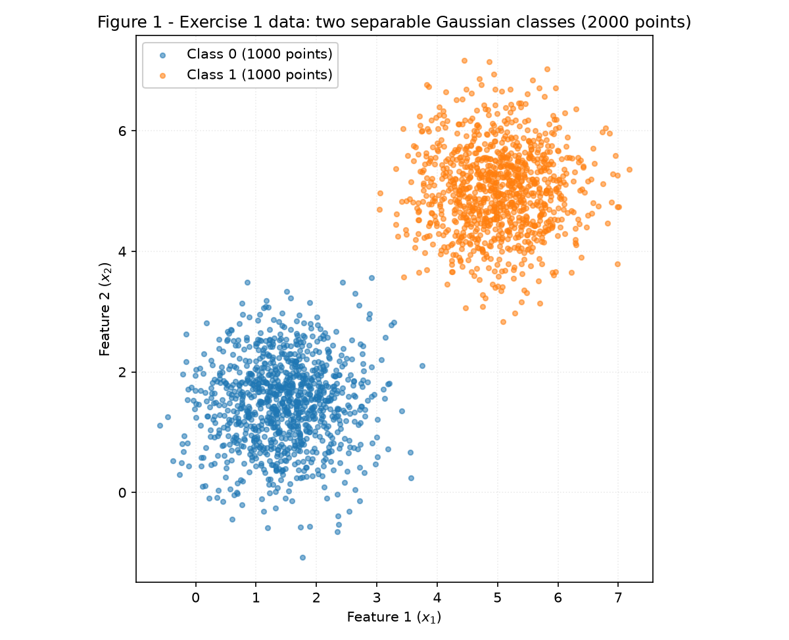
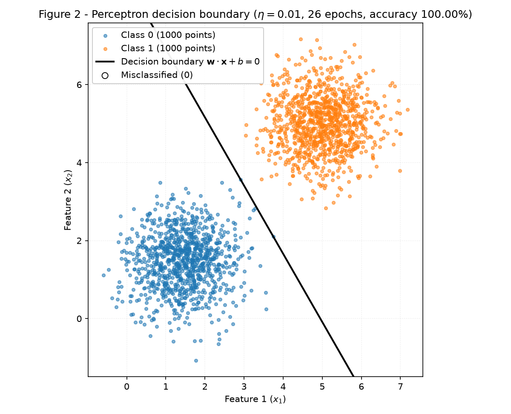
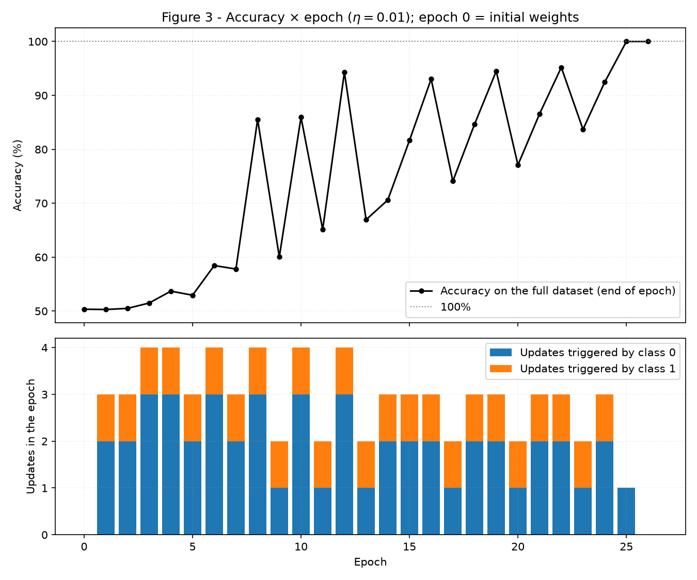
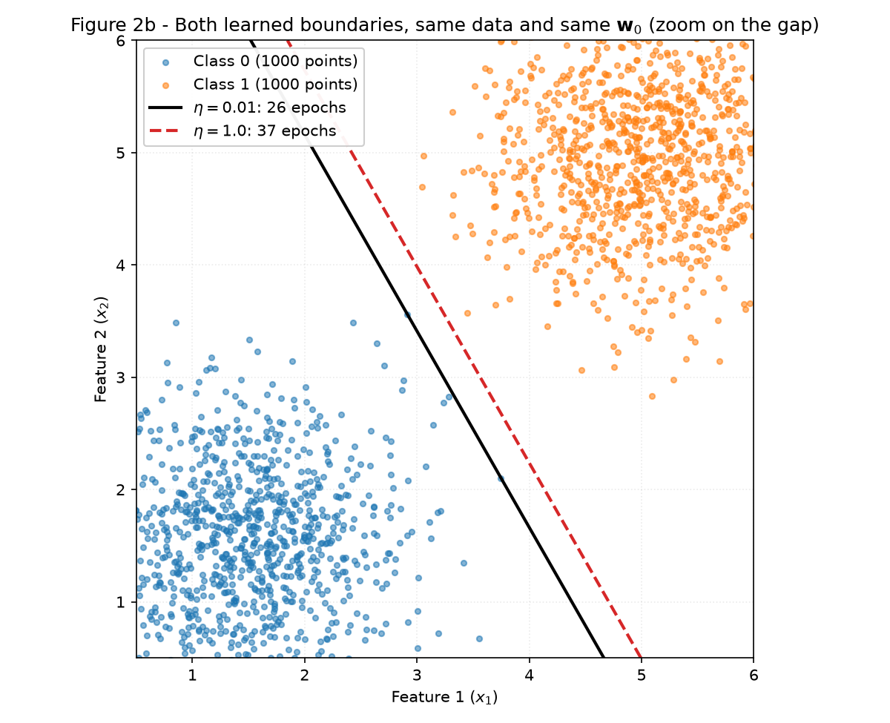
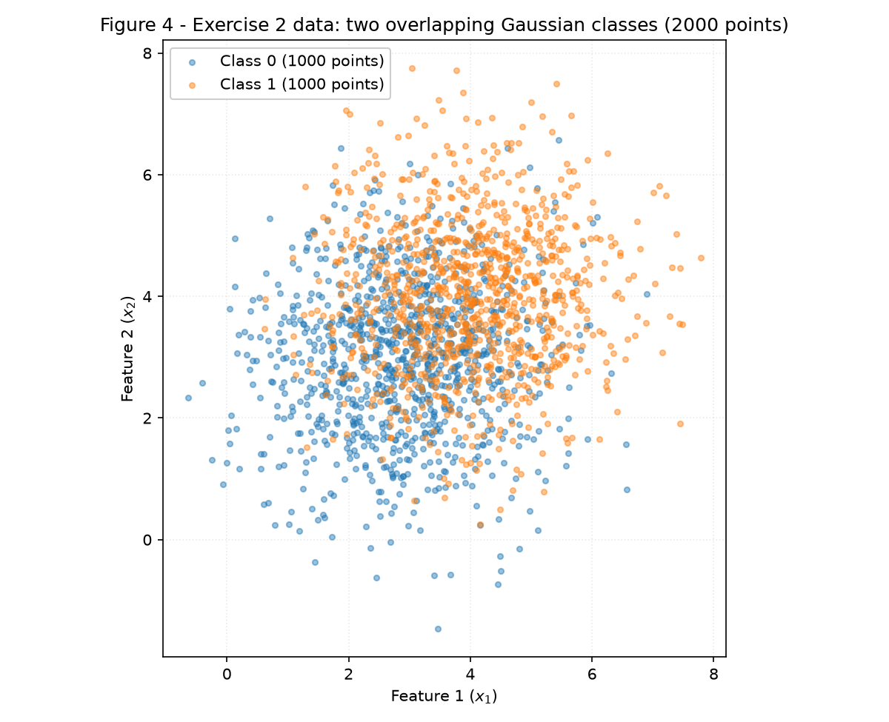
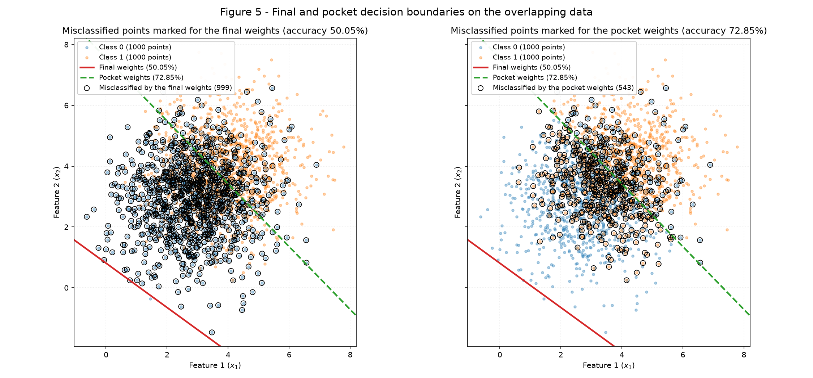
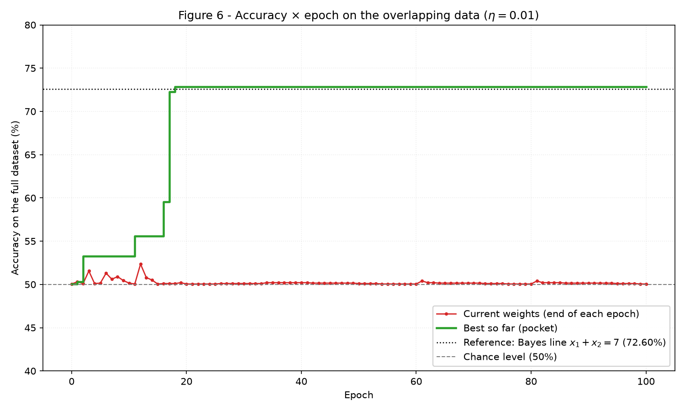
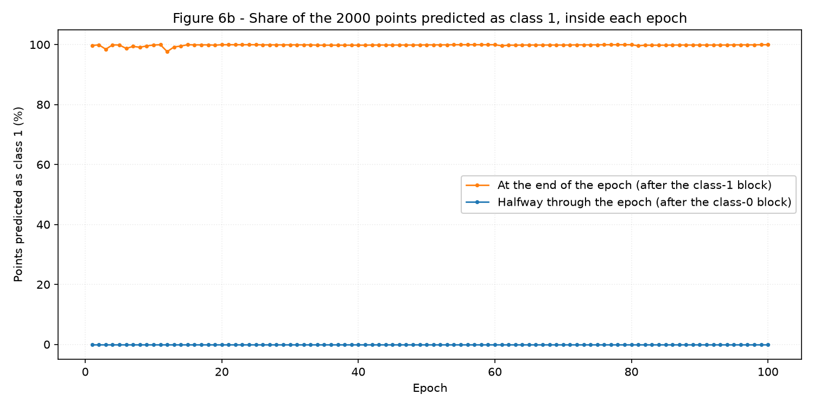

# Perceptron — Understanding Perceptrons and Their Limitations

**Luca Santana Feltrin** — Insper, ANN & Deep Learning 2026.2

The thread running through this activity is **separability**. The same perceptron is trained on two
datasets: one it was designed for, where a straight line with zero errors exists, and one where no
such line exists. The interesting part is not that the second one fails. It is *how* it fails. The
update rule keeps firing forever, and the weights the loop happens to hold when it is stopped are an
arbitrary snapshot of a cycle, not an approximation of the best line.

## How to reproduce

Each exercise is a standalone script under [`code/`](https://github.com/LucaFeltrin14/ann-dl/tree/main/docs/exercises/perceptron/code),
and both import the same model from `perceptron.py`. Each script opens with
`rng = np.random.default_rng(42)` and draws everything from that single generator, from the data to
the initial weights. Running a script twice therefore gives exactly the numbers reported below. Every
script prints all of its reported values to stdout and rewrites its figures.

```shell
python3 -m venv .venv && source .venv/bin/activate
python -m pip install -r requirements.txt --upgrade

python docs/exercises/perceptron/code/exercise1_separable.py      # ~1 s
python docs/exercises/perceptron/code/exercise2_overlapping.py    # ~10 s (includes the checks of item D)
```

Libraries used: `numpy` and `matplotlib` only. **No third-party model is used anywhere.** The
activation, the prediction, the update rule and the training loop are all in `perceptron.py`.

## Implementation approach and challenges

The code is split into three files:

- **`perceptron.py`** holds the model and nothing else:
    - `step`, the Heaviside activation, with \(\text{step}(0) = 1\).
    - A `Perceptron` class with `predict`, `update` (one sample, the \(\{0,1\}\) error-driven rule)
      and `fit`, the training loop with the stopping rule.
    - `fit` records the accuracy, the number of updates split by class, and \((\mathbf{w}, b)\) at
      the end of every epoch.
    - The pocket of Exercise 2 is part of `fit` from the start: after every update, if the accuracy
      on the full dataset beats every accuracy seen so far, \((\mathbf{w}, b)\) is copied aside. In
      Exercise 1 this changes nothing, since the pocket simply ends equal to the converged weights.
      This is what allows Exercise 2 to reuse the implementation **unchanged**.
- **`common.py`** holds the data generator, the plotting helpers, and a replay of a single epoch. The
  replay is described in the last decision below.
- **`exercise1_separable.py`** and **`exercise2_overlapping.py`** hold one script per exercise.

These are the decisions that took some thought, stated here because the results depend on them:

1. **Sample order.** The statement does not ask for shuffling. The data is presented in generation
   order in every epoch: the 1000 samples of class 0, then the 1000 of class 1. This turns out to
   decide *which* wrong answer the final weights give in Exercise 2, so item 2D explains it and
   repeats the training with shuffled orders to check that the conclusion does not depend on it.
2. **"Changing nothing else."** The \(\eta = 1.0\) re-run of item 1D must differ from the first run
   only in \(\eta\). \(\mathbf{w}_0\) is therefore drawn **once** and reused. Drawing it again from
   the generator would have changed two things at once.
3. **Counting epochs.** The loop stops at the first full pass without an update. That pass is
   counted, so "26 epochs" means updates happened in epochs 1–25 and epoch 26 confirmed that none
   were left.
4. **Looking inside an epoch.** `fit` only records end-of-epoch states, but the analysis of Exercise 2
   needs to know what happens *during* an epoch. `replay_epoch` re-runs an epoch from the state `fit`
   recorded at the end of the previous one, using the same `Perceptron.update`. Because the loop is
   deterministic, the replay reproduces `fit` exactly, and the script asserts this for every epoch.

## AI collaboration

As declared in this page's front matter: Claude (Anthropic) was used to write the perceptron and
data-generation scripts and to draft this report. Every number below is produced by the committed
code and printed by it at run time. Nothing was written into the text by hand without the script
backing it. I reviewed the code and the analysis and can explain every step.

---

## Exercise 1

### A — Generate the data

1000 samples per class, drawn with `rng.multivariate_normal` from the means and covariance given in
the statement:

| Class | Mean | Covariance | Sample mean | Sample std |
|---|---|---|---|---|
| 0 | [1.5, 1.5] | [[0.5, 0], [0, 0.5]] | [1.4495, 1.4725] | [0.7006, 0.7159] |
| 1 | [5, 5] | [[0.5, 0], [0, 0.5]] | [5.0102, 5.0126] | [0.7030, 0.7061] |

The sample standard deviations match \(\sqrt{0.5} = 0.7071\). The two centres are
\(3.5\sqrt2 = 4.95\) apart, about seven standard deviations, so the clouds do not touch (Figure 1).


/// caption
**Figure 1** — the 2000 points of Exercise 1, one colour per class.
///

### B — Implement the perceptron

The model is written once, in `perceptron.py`, and imported unchanged by both exercises:

- **Prediction.** \(\hat y = \text{step}(\mathbf{w}\cdot\mathbf{x} + b)\), with
  \(\text{step}(z) = 1\) if \(z \ge 0\) and \(0\) otherwise.
- **Update rule.** For each sample:
  \(\mathbf{w} \leftarrow \mathbf{w} + \eta\,(y - \hat y)\,\mathbf{x}\) and
  \(b \leftarrow b + \eta\,(y - \hat y)\).
    - With 0/1 labels the error \(y - \hat y\) is \(0\) on a correct prediction, so correct samples
      leave the weights untouched.
    - It is \(+1\) on a false negative, which pulls the line towards \(\mathbf{x}\).
    - It is \(-1\) on a false positive, which pushes the line away from it.
- **Initialization.** \(\mathbf{w}_0\) is drawn from `rng.normal(0, 0.01, size=2)`, which gives
  \(\mathbf{w}_0 = [0.0025, 0.0090]\) with \(\lVert\mathbf{w}_0\rVert = 0.0093\), and \(b_0 = 0\).
  The initial weights classify 50.35% of the points correctly, which is no better than chance.
- **Learning rate.** \(\eta = 0.01\).
- **Stopping rule.** The loop stops at the first full pass with no update, or after 100 epochs. The
  accuracy on the full dataset is recorded after every epoch.

```python title="perceptron.py"
--8<-- "docs/exercises/perceptron/code/perceptron.py"
```

### C — Train and measure

| Quantity | Value |
|---|---|
| Final \(\mathbf{w}\) | **[0.0505, 0.0289]** |
| Final \(b\) | **−0.2500** |
| Epochs | **26**: updates in epochs 1–25, and epoch 26 is the first update-free pass |
| Final accuracy | **100.00%** (0 of 2000 misclassified) |


/// caption
**Figure 2** — the learned boundary \(\mathbf{w}\cdot\mathbf{x} + b = 0\) over the data. Misclassified
points would be circled in black; the legend reports that there are none.
///


/// caption
**Figure 3** — top: accuracy on the full dataset at the end of every epoch, with epoch 0 being the
initial weights. Bottom: number of updates in each epoch, split by the class of the sample that
triggered it.
///

### D — Analysis

**Why does separable data converge quickly?**

The update rule is *error-driven*: \(y - \hat y = 0\) on every correctly classified sample, so only
mistakes move the weights. On separable data there is at least one line that makes no mistakes. The
perceptron convergence theorem guarantees that the loop reaches such a line after a *finite* number
of mistakes, at most \((R/\gamma)^2\), a bound that depends on the geometry of the data and not on
how many samples or epochs there are. Once the loop gets there, every error is zero, the weights
stop moving, and the stopping rule fires. Convergence is exact, not approximate.

The numbers show how little work that takes:

- **73 updates** in total (49 on class 0, 24 on class 1) over 52 000 sample presentations. 99.86% of
  the presentations changed nothing.
- The updates per epoch are **few from the very start**: 2 to 4 per epoch, i.e. at most 0.2% of the
  2000 samples.
- The count **drops to 1 in epoch 25 and to 0 in epoch 26**, and there the loop stops by itself.
- Only 14 distinct samples ever triggered an update, and 27 of the 73 updates were on the very first
  sample of a class block.

Figure 3 also shows why it takes 26 epochs rather than 2. The accuracy zig-zags between 50% and
95% because the weights start tiny (0.0093), while one mistake moves them a lot:

- Each mistake moves \(\mathbf{w}\) by \(\eta\lVert\mathbf{x}\rVert \approx 0.047\) and \(b\) by only
  \(\eta = 0.01\).
- The first class-0 samples of an epoch push the line one way, and the first class-1 sample pushes it
  back.
- To sit in the gap, the line needs an offset of \(-b/\lVert\mathbf{w}\rVert \approx 4.3\) from the
  origin (the midpoint of the class means along \(\mathbf{w}\) is at 4.43), so \(b\) has to become
  several times \(\lVert\mathbf{w}\rVert\).
- But \(b\) changes by exactly \(\pm\eta\) per mistake, so
  \(b = \eta\,(N_1 - N_0) = 0.01 \cdot (24 - 49) = \mathbf{-0.25}\). That is 25 net class-0
  corrections, about one per epoch, which is the 25 epochs with updates.

The mistakes that remain are few, and each one is a correction towards a line that exists. What
sets the number of epochs is how slowly the bias can walk.

**The same training with \(\eta = 1.0\).** Same data, same order, same \(\mathbf{w}_0\):

| Run | Epochs | Accuracy | \(\mathbf{w}\) | \(b\) | \(\mathbf{w}/\lVert\mathbf{w}\rVert\) | Angle of \(\mathbf{w}\) | Offset \(-b/\lVert\mathbf{w}\rVert\) |
|---|---|---|---|---|---|---|---|
| \(\eta = 0.01\) | **26** | **100.00%** | [0.0505, 0.0289] | −0.25 | [0.8681, 0.4963] | 29.759° | 4.2979 |
| \(\eta = 1.0\) | **37** | **100.00%** | [5.8706, 3.3592] | −31.00 | [0.8679, 0.4967] | 29.779° | 4.5832 |

Both runs separate the data perfectly, but with different boundaries (Figure 2b). Here the two
directions agree to within **0.02°**, so the lines are practically parallel. The difference is where
they sit along that direction: 4.30 against 4.58 from the origin, a gap of **0.29**. The runs also
take different numbers of epochs, 26 against 37.


/// caption
**Figure 2b** — the boundaries learned with \(\eta = 0.01\) (solid) and \(\eta = 1.0\) (dashed) from
the same \(\mathbf{w}_0\), zoomed on the gap between the classes.
///

*What \(\eta\) controls.* Unrolling the rule gives
\(\mathbf{w}_T = \mathbf{w}_0 + \eta\sum_t e_t\,\mathbf{x}_t\) and \(b_T = \eta\sum_t e_t\), where
\(e_t = y_t - \hat y_t\). Dividing by \(\eta > 0\) does not change any prediction, because step only
reads a sign. So the run \((\mathbf{w}_0, \eta)\) makes exactly the same mistakes as a run with
\(\eta = 1\) started from \(\mathbf{w}_0/\eta\). **The only thing \(\eta\) changes is how large the
random start is compared with one update**, and a single update adds \(\mathbf{x}\), with
\(\lVert\mathbf{x}\rVert \approx 4.65\) on average:

- **\(\eta = 0.01\)** behaves like a start of size \(\lVert\mathbf{w}_0\rVert/\eta = 0.93\), about a
  fifth of one update. That is enough to tilt the first predictions and change which samples are
  misclassified early on. The sequence of mistakes then differs, with 25 net bias steps instead of 31,
  so the line ends at a different offset.
- **\(\eta = 1.0\)** behaves like a start of size 0.0093, 1/500 of one update. The random start is
  wiped out by the first mistake, and the run is *the zero-start run*. Its weights differ from the
  \(\mathbf{w} = \mathbf{0}\), \(\eta = 1\) run by exactly \([0.0025, 0.0090] = \mathbf{w}_0\), with
  the same \(b = -31\) and the same 37 epochs: it made exactly the same mistakes.

**What would have happened from \(\mathbf{w} = \mathbf{0}\), \(b = 0\).** Write
\((\mathbf{w}^{(\eta)}_t, b^{(\eta)}_t)\) for the state after \(t\) sample presentations with learning
rate \(\eta\), starting from zero. Let \((\mathbf{u}_t, c_t)\) be the same run with \(\eta = 1\).

*Claim:* \(\mathbf{w}^{(\eta)}_t = \eta\,\mathbf{u}_t\) and \(b^{(\eta)}_t = \eta\,c_t\) for every
\(t\) and every \(\eta > 0\).

*Proof by induction.*

- **Base.** At \(t = 0\), \(\mathbf{0} = \eta\cdot\mathbf{0}\) and \(0 = \eta\cdot 0\).
- **Step.** Assume the claim holds at \(t\), and let \((\mathbf{x}, y)\) be the next sample. The
  prediction is
  \[
  \hat y^{(\eta)} = \text{step}\big(\eta(\mathbf{u}_t\cdot\mathbf{x} + c_t)\big)
                  = \text{step}\big(\mathbf{u}_t\cdot\mathbf{x} + c_t\big) = \hat y^{(1)},
  \]
  because multiplying by \(\eta > 0\) keeps the sign of a non-zero number and keeps zero at zero,
  so \(\text{step}\) returns the same value. The error \(e = y - \hat y\) is therefore the same in
  both runs, and
  \[
  \mathbf{w}^{(\eta)}_{t+1} = \eta\,\mathbf{u}_t + \eta\,e\,\mathbf{x} = \eta\,(\mathbf{u}_t + e\,\mathbf{x}) = \eta\,\mathbf{u}_{t+1},
  \qquad
  b^{(\eta)}_{t+1} = \eta\,c_t + \eta\,e = \eta\,c_{t+1}. \qquad\blacksquare
  \]

Applying the claim to two learning rates gives
\(\mathbf{w}^{(\eta_2)}_t = (\eta_2/\eta_1)\,\mathbf{w}^{(\eta_1)}_t\) and
\(b^{(\eta_2)}_t = (\eta_2/\eta_1)\,b^{(\eta_1)}_t\) at every step. Two consequences follow:

- **The same predictions at every step.** Both runs make the same mistakes and reach their first
  update-free pass in the same epoch, so the epoch count is identical.
- **The same boundary.** The set \(\{\mathbf{x} : \mathbf{w}\cdot\mathbf{x} + b = 0\}\) does not
  change when \((\mathbf{w}, b)\) is multiplied by a positive constant.

So from a zero start \(\eta\) has no effect at all. The script checks this numerically:

| Zero start | \(\mathbf{w}\) | \(b\) | Epochs | Accuracy |
|---|---|---|---|---|
| \(\eta = 0.01\) | [0.0587, 0.0335] | −0.31 | 37 | 100.00% |
| \(\eta = 1.0\) | [5.8681, 3.3503] | −31.00 | 37 | 100.00% |

The ratio is **exactly 100** in \(\mathbf{w}\) and in \(b\), at the end of every one of the 37 epochs,
and the two runs give identical predictions on all 2000 points. With \(\mathbf{w}_0 \ne \mathbf{0}\)
the base case fails: \(\mathbf{w}_0\) is not \(\eta\) times anything independent of \(\eta\). That is
the only reason the two runs of the previous paragraph could differ, and it is why item B forbids the
zero start.

```python title="common.py"
--8<-- "docs/exercises/perceptron/code/common.py"
```

```python title="exercise1_separable.py"
--8<-- "docs/exercises/perceptron/code/exercise1_separable.py"
```

---

## Exercise 2

### A — Generate the data

The same generator, now with close means and a spread three times larger:

| Class | Mean | Covariance | Sample mean | Sample std |
|---|---|---|---|---|
| 0 | [3, 3] | [[1.5, 0], [0, 1.5]] | [2.9126, 2.9524] | [1.2135, 1.2399] |
| 1 | [4, 4] | [[1.5, 0], [0, 1.5]] | [4.0177, 4.0218] | [1.2177, 1.2230] |

The centres are only \(\sqrt2 = 1.41\) apart against a standard deviation of
\(\sqrt{1.5} = 1.22\) per axis. The clouds overlap almost entirely (Figure 4).


/// caption
**Figure 4** — the 2000 points of Exercise 2, one colour per class.
///

### B — Train, keeping the best weights

The run uses the Exercise 1 implementation, unchanged, with \(\eta = 0.01\), a cap of 100 epochs,
the same kind of initialization (\(\mathbf{w}_0 = [0.0025, 0.0090]\), \(b_0 = 0\)) and the pocket
tracked inside `fit`. The loop never stops on its own: all **100 epochs** run, and even the quietest
epoch had 2 updates.

| Weights | \(\mathbf{w}\) | \(b\) | Accuracy | Misclassified |
|---|---|---|---|---|
| **Final** (after epoch 100) | **[0.0361, 0.0494]** | **−0.0400** | **50.05%** | 999 |
| **Pocket** (best seen, epoch **18**) | **[0.0068, 0.0066]** | **−0.0500** | **72.85%** | 543 |
| *Reference, not fitted: Bayes line \(x_1 + x_2 = 7\)* | [1, 1] | −7 | 72.60% (71.81% expected) | 548 |

The reference row is the Bayes-optimal boundary for two Gaussians with equal covariance: the
perpendicular bisector of the means. On this sample it scores 72.60%, and its expected accuracy is
\(\Phi(\sqrt2 / (2\sqrt{1.5})) = 71.81\%\). The pocket is right on it, slightly above because it was
picked on the sample itself. The final weights are at chance.

### C — Figures


/// caption
**Figure 5** — both boundaries, final (solid red) and pocket (dashed green), over the data. On the
left, the points misclassified by the final weights are circled; on the right, those misclassified by
the pocket weights.
///


/// caption
**Figure 6** — accuracy of the current weights at the end of each epoch (red) and of the best weights
seen so far, i.e. the pocket (green). The dotted line is the Bayes line, for reference.
///

### D — Analysis

**Explain the gap. Where does the final boundary sit, and why does the loop leave it there?**

The final line sits **outside the cloud**. Its offset from the origin is
\(-b/\lVert\mathbf{w}\rVert = 0.65\), while the centre of the data lies 4.86 from the origin along
the same direction. The line therefore runs below and to the left of all the data (Figure 5, left),
and **99.95%** of the points fall on its positive side. The final weights predict class 1 for almost
everything, which misclassifies 999 points (the whole of class 0 minus one) and scores 50.05%, the
share of class 1. The pocket line has offset 5.25 against a data centre at 4.92, at an angle of 44.1°
against the Bayes line's 45°. It cuts through the middle of the overlap, as the best line must.

Three facts from the update rule explain why the loop leaves the line there.

1. ***The bias cannot walk.*** Following the hint:
    - Per mistake, \(b\) moves by \(\eta = 0.01\), while \(\mathbf{w}\) moves by
      \(\eta\lVert\mathbf{x}\rVert \approx 0.051\), about 5 times more, since
      \(\lVert\mathbf{x}\rVert \approx 5.07\) here.
    - To pass through the centre of the cloud with the final \(\mathbf{w}\), the bias would have to be
      \(-0.297\). It is \(-0.04\).
    - The bias is just a count of mistakes, \(b = \eta\,(N_1 - N_0) = 0.01\cdot(189 - 193)\). Mistakes
      on the two classes come in pairs and cancel, so \(b\) hovers near zero.
    - \(\lVert\mathbf{w}\rVert\) never grows either: it stays between 0.0088 and 0.0689 over the 100
      epochs.
    - A line with \(b \approx 0\) passes near the origin, and the origin is ~5 units from a cloud that
      sits entirely in the first quadrant.
2. ***One mistake throws the line across the whole cloud.***
    - A mistake on \(\mathbf{x}\) shifts the score \(\mathbf{w}\cdot\mathbf{x}' + b\) of *every* point
      \(\mathbf{x}'\) by \(\eta\,e\,(\mathbf{x}\cdot\mathbf{x}' + 1)\). All points here sit around
      \((3.5, 3.5)\), so \(\mathbf{x}\cdot\mathbf{x}' \approx 24\) on average, and that shift is about
      **0.25**.
    - The scores of the whole dataset under the final weights have a standard deviation of only
      **0.089**.
    - A single update therefore moves every point's score by almost three standard deviations of the
      whole distribution. It does not nudge the line through the cloud; it pushes the line clean
      across it.
3. ***The last mistake of every epoch is on class 1.*** Replaying the epochs shows the cycle:
    - The first class-0 sample is predicted 1. That mistake throws the line to the other side, and
      **every** point is now predicted 0. The remaining class-0 samples are correct and cause no
      updates.
    - The first class-1 sample is then predicted 0. That mistake throws the line back, and every
      point is predicted 1 for the rest of the epoch.
    - 200 of the 382 updates, two per epoch, were on the very first sample of a class block.
    - After the class-0 block, the model predicts class 1 for **0.00%** of the points in *every one*
      of the 100 epochs. At the end of the epoch it predicts class 1 for **99.80%** on average
      (Figure 6b).

"The final weights" are the snapshot taken at the end of the class-1 block, so they are always the
"everything is class 1" half of the cycle. That is how the loop ends at ≈ 50%, and it would do so
whatever the epoch cap. The pocket only works because it evaluates the accuracy *after every update*:
once in a while (epoch 18 here), an update lands the line inside the cloud before the next mistake
throws it out again, and the pocket keeps that moment.


/// caption
**Figure 6b** — share of the 2000 points predicted as class 1, halfway through each epoch (after the
class-0 block) and at its end. The weights flip between "all class 0" and "all class 1" twice per
epoch. The flat red curve of Figure 6 is this oscillation, always sampled at the same phase.
///

**Figure 3 against Figure 6. What does the convergence theorem guarantee, and which assumption is
broken?**

- **Figure 3.** The curve reaches 100%, and in epoch 26 a full pass produces no update, so the loop
  stops by itself.
- **Figure 6.** All 100 epochs run and no epoch is ever update-free (between 2 and 4 updates, 3.82 on
  average). The red curve never leaves 50.05%–52.35%, while the pocket climbs in steps to 72.85% and
  then stays flat. The red curve looks calm only because it is always sampled at the same point of the
  cycle; Figure 6b shows that the weights never settle.

The perceptron convergence theorem (Rosenblatt; Novikoff's bound) has two hypotheses:

- The data is **linearly separable with a margin**: some unit vector \((\mathbf{w}^*, b^*)\) puts
  every point on its correct side at a distance of at least \(\gamma > 0\).
- The inputs are bounded, \(\lVert\mathbf{x}\rVert \le R\).

Under these hypotheses the perceptron makes **at most \((R/\gamma)^2\) mistakes**, in any order of
presentation, and then stops with a separating line. This dataset breaks the first hypothesis:

- No line separates the classes. Even the Bayes line misclassifies 27.40% of the points, so no
  \(\gamma > 0\) exists and the bound is void.
- For every \((\mathbf{w}, b)\) there is always some misclassified sample, so the error-driven rule
  fires in every epoch, forever.
- The theorem says nothing about the quality of the iterate once its hypothesis fails. What actually
  happens is the cycle above.

**Does adding more epochs fix it? Does a smaller \(\eta\)?**

**Neither.** The argument comes from the update rule:

- **More epochs.** The cycle does not depend on the epoch number. Every epoch has a misclassified
  sample, so every epoch updates, and every epoch ends right after the class-1 flip. More epochs only
  replay the same cycle more times. They also give the *pocket* more chances to catch a good moment,
  but they do nothing for the final iterate.
- **Smaller \(\eta\).** From the scaling argument of item 1D, the run with \(\mathbf{w}_0\) and rate
  \(\eta\) makes the same mistakes as a run with rate 1 started from \(\mathbf{w}_0/\eta\). A smaller
  \(\eta\) therefore only makes the random start relatively *larger*, which affects the first few
  epochs and nothing after that. The quantity that causes the flip does not depend on \(\eta\): the
  score shift per mistake and the spread of the scores both scale with \(\eta\), so their ratio
  (≈ 2.8 here) is the same. The ratio \(|\Delta b| / \lVert\Delta\mathbf{w}\rVert = 1/\lVert\mathbf{x}\rVert\)
  does not involve \(\eta\) at all.

The script confirms both answers. Every run below uses the same data and the same \(\mathbf{w}_0\):

| \(\eta\) | Epochs | Final accuracy | Pocket accuracy | Updates in the last epoch |
|---|---|---|---|---|
| 0.01 | 100 | 50.05% | 72.85% | 4 |
| 0.01 | 1000 | 50.30% | 73.35% | 4 |
| 0.001 | 100 | 50.10% | 72.85% | 4 |
| 0.001 | 1000 | 50.35% | 73.15% | 4 |

The final iterate stays at chance and the loop is still updating in the last epoch, whatever the
budget and whatever the rate. Only the pocket reaches the best line.

*Is the ≈ 50% an artefact of presenting the classes in two blocks?* The *exact* number is, but the
failure is not. The same training was repeated with shuffled data:

| Order | Final accuracy | Pocket / best seen | Converged |
|---|---|---|---|
| Shuffled once | 72.60% | 73.40% | No |
| Reshuffled every epoch | 57.70% | 73.35% | No |

- **Shuffled once.** The accuracy at the end of an epoch swings anywhere between 52.35% and 73.05%,
  and this time the last snapshot happened to land high.
- **Reshuffled every epoch.** The last snapshot landed at 57.70%.
- **Neither order converges.** In every order, the final weights are wherever the last mistake left
  them, which is a lottery. Only the pocket reliably returns the best line.

The order decides *which* arbitrary snapshot the final weights are; separability is what would make
the snapshot stop moving.

```python title="exercise2_overlapping.py"
--8<-- "docs/exercises/perceptron/code/exercise2_overlapping.py"
```

---

## Results summary

| # | Quantity | Value |
|---|---|---|
| 1 | Exercise 1 — final \(\mathbf{w}\) and \(b\) | \(\mathbf{w}\) = **[0.0505, 0.0289]**, \(b\) = **−0.2500** |
| 2 | Exercise 1 — epochs to convergence | **26** (updates in epochs 1–25; epoch 26 is the first update-free pass) |
| 3 | Exercise 1 — final accuracy | **100.00%** (0 of 2000 misclassified) |
| 4 | Exercise 1 — epochs and final accuracy with \(\eta = 1.0\) | **37 epochs**, **100.00%** |
| 5 | Exercise 2 — final \(\mathbf{w}\) and \(b\) | \(\mathbf{w}\) = **[0.0361, 0.0494]**, \(b\) = **−0.0400** |
| 6 | Exercise 2 — accuracy of the final weights | **50.05%** (999 of 2000 misclassified) |
| 7 | Exercise 2 — accuracy of the pocket weights | **72.85%** (543 misclassified), with \(\mathbf{w}\) = [0.0068, 0.0066], \(b\) = −0.0500 |
| 8 | Exercise 2 — epoch at which the pocket best occurred | **18** |
